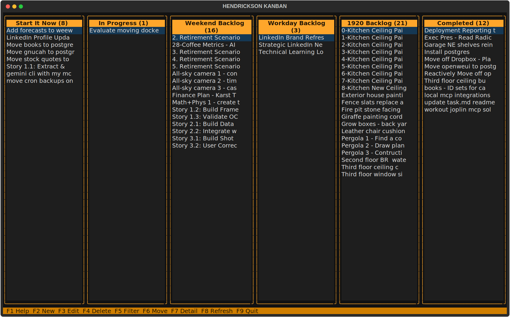

# Task.md Utilities (HENDRICKSON KANBAN)

A REST API, MCP server, and interactive CLI for managing tasks organized in lanes, where each task is a markdown file. The CLI includes a full-screen Textual TUI (kanban board with keyboard navigation) as well as non-interactive subcommands for scripting.

## About Tasks.md

This project builds on and extends the [Tasks.md](https://github.com/BaldissaraMatheus/Tasks.md) project. For comprehensive information about the Tasks.md system, including task visualization, board views, file format specifications, and VSCode integration, visit the [Tasks.md repository](https://github.com/BaldissaraMatheus/Tasks.md).

This package adds a REST API, a network-capable interactive CLI, and an MCP server for programmatic task management.

## Overview

Tasks are stored as markdown files organized in lane directories:
- Task title = filename (without `.md`)
- Tags: `[tag:tagname]` — one per line at the top of the file
- Due dates: `[due:YYYY-MM-DD]`
- Tasks can be split into subtasks using the `[[split]]` marker

## Architecture

```
┌─────────────┐     HTTP      ┌──────────────────┐
│  tasks CLI  │ ─────────────▶│  Flask REST API   │  :2999 (internal)
│  (bin/tasks)│               │  (task_api/)      │  :3101 (host)
└─────────────┘               └────────┬─────────┘
                                        │
                              ┌─────────▼─────────┐
┌─────────────┐    MCP        │     task_lib/      │
│ AI assistant│ ─────────────▶│  MCP Server        │  :3003
│ (Claude etc)│               │  (mcp_task_service)│
└─────────────┘               └────────┬─────────┘
                                        │
                              ┌─────────▼─────────┐
                              │  Markdown files    │
                              │  /data/tasks/      │
                              └───────────────────┘
```

## Project Structure

```
task.md-utilities/
├── bin/
│   ├── tasks               # CLI — TUI (no args) or subcommands (scripting)
│   └── tag-utility.py      # One-time tag format migration utility
├── docs/
│   └── screenshot.svg      # TUI kanban board screenshot
├── task_lib/
│   ├── api_client.py       # Shared HTTP helpers (used by CLI and TUI)
│   ├── config.py           # Configuration (YAML)
│   ├── task.py             # Task model and file I/O
│   └── task_manager.py     # Lane and task operations
├── task_tui/               # Textual TUI package
│   ├── app.py              # KanbanApp — main board, keybindings, workers
│   ├── api.py              # Sync API wrappers for use in workers
│   ├── screens.py          # Detail, form, confirm, filter, move screens
│   └── widgets.py          # LaneColumn, TaskItem, FunctionKeyBar
├── task_api/               # Flask REST API service
│   ├── app.py
│   ├── config.py
│   ├── models.py           # Pydantic request/response schemas
│   ├── routes/
│   ├── gunicorn.conf.py
│   ├── Dockerfile
│   ├── docker-compose.yml
│   └── README.md
├── mcp_task_service/       # FastMCP server for AI assistants
│   ├── server.py
│   ├── Dockerfile
│   ├── docker-compose.yml
│   └── README.md
├── tests/                  # pytest suite
├── config.yaml             # Task data location (baked into Docker images)
└── docker-compose.yml      # Deploys both services together
```

## Deployment

Both services are deployed as Docker containers. Build from the **repo root** (build context must include both `task_lib/` and the service directory).

### Build images

```bash
docker build -t localhost:5000/task-api:latest -f task_api/Dockerfile .
docker build -t localhost:5000/task-manager-mcp:latest -f mcp_task_service/Dockerfile .

docker push localhost:5000/task-api:latest
docker push localhost:5000/task-manager-mcp:latest
```

### Deploy

```bash
docker-compose up -d
```

The root `docker-compose.yml` starts both services on a shared network:

| Service | Internal port | Host port |
|---------|--------------|-----------|
| REST API | 2999 | 3101 |
| MCP server | 3003 | 3003 |

Both containers mount the task data directory:
```yaml
volumes:
  - /mnt/raid1/lib/tasks.md/tasks:/data/tasks
```

### Configuration

`config.yaml` (committed to the repo) sets the task data location inside the container. It is copied into the image at build time — no volume mount needed:

```yaml
base_dir: /data/tasks
```

To change the data path, edit `config.yaml` and rebuild the images.

### Running services individually

Each service has its own `docker-compose.yml` for standalone use:

```bash
cd task_api && docker-compose up -d       # REST API only
cd mcp_task_service && docker-compose up -d  # MCP only
```

## CLI (`bin/tasks`)

The `tasks` binary has two modes:

- **No arguments** — launches the full-screen interactive TUI (kanban board)
- **With a subcommand** — runs non-interactively for scripting

### Installation

```bash
poetry install
chmod +x bin/tasks
```

### API URL configuration

Resolution order (first match wins):

1. `--api-url URL` flag
2. `TASKS_API_URL` environment variable
3. `~/.config/tasks/config.yaml` → `api_url` key
4. Default: `http://localhost:3101`

Create `~/.config/tasks/config.yaml` to set a permanent remote URL:
```yaml
api_url: http://your-server:3101
```

---

### Interactive TUI

```bash
tasks
```

Launches a full-screen kanban board. Lanes are displayed as side-by-side columns; tasks are listed under each lane.



#### Keyboard navigation

| Key | Action |
|-----|--------|
| `←` / `→` | Move between lanes |
| `↑` / `↓` | Move between tasks within a lane |
| `Enter` | Open task detail view |
| `Esc` | Go back / close dialog |
| `F1` | Show keyboard shortcut help |
| `F2` | New task (in the focused lane) |
| `F3` | Edit selected task |
| `F4` | Delete selected task (confirm prompt) |
| `F5` | Filter tasks (by lane, tag, or title substring) |
| `F6` | Move selected task to another lane |
| `F7` | Open / close task detail view |
| `F8` | Refresh board from the API |
| `F9` | Quit |

Active filters are shown in a status bar at the top; press `F5` again to change or clear them.

---

### Subcommands

```
tasks [--api-url URL] COMMAND

Commands:
  show    List tasks (--lane, --tag, --string filters)
  get     Show a single task in full
  add     Create a new task
  update  Update task fields
  delete  Move a task to Trash
  move    Change a task's lane
  split   Split tasks containing [[split]] marker
  lanes   Manage lanes
    list  List lanes with task counts
    add   Create a new lane
  stats   Show statistics summary
```

### Examples

```bash
# List all tasks
tasks show

# Filter by lane, tag, or title substring (all case-insensitive)
tasks show --lane "In Progress"
tasks show --tag urgent
tasks show --string "login"

# Show full task detail
tasks get "Implement login"

# Create a task (prompts for missing fields)
tasks add --title "Fix bug" --content "Reproduce and fix" --lane Backlog --tags "bug,urgent"

# Update fields (only provided fields change)
tasks update "Fix bug" --tags "bug,urgent,p1" --due-date 2026-06-01

# Move between lanes
tasks move "Fix bug" "In Progress"

# Delete (moves to Trash, prompts for confirmation)
tasks delete "Fix bug"

# Lane management
tasks lanes list
tasks lanes add "Sprint 3"

# Split a task (divides on [[split]] marker)
tasks split

# Statistics
tasks stats
```

## MCP Server

The MCP server exposes kanban operations to AI assistants (Claude, Cursor, etc.) via the [Model Context Protocol](https://modelcontextprotocol.io/).

### Connecting a client

Add to your Claude Desktop / Claude Code config (`~/.claude/claude_desktop_config.json` or `.mcp.json`):

```json
{
  "mcpServers": {
    "task-manager": {
      "type": "http",
      "url": "http://localhost:3003/mcp"
    }
  }
}
```

### Available tools

| Tool | Description |
|------|-------------|
| `add_task` | Create a task (title, content, lane, tags, due_date) |
| `get_task` | Retrieve a task by title |
| `update_task` | Update task fields |
| `delete_task` | Move a task to Trash |
| `move_task_to_lane` | Move a task to a different lane |
| `list_tasks` | List tasks (lane and tag filters, case-insensitive) |
| `list_lanes` | List lanes with task counts |
| `add_lane` | Create a new lane |
| `split_tasks` | Split tasks with `[[split]]` marker |
| `empty_trash` | Permanently delete Trash contents |
| `get_statistics` | Lane, tag, and due-date statistics |

Title and tag matching is **case-insensitive** across all tools.

See [`mcp_task_service/README.md`](mcp_task_service/README.md) for full details.

## REST API

The REST API is documented in [`task_api/README.md`](task_api/README.md).

Quick reference:

```bash
# Health check
curl http://localhost:3101/health

# List tasks
curl "http://localhost:3101/tasks"
curl "http://localhost:3101/tasks?lane=Backlog&tag=urgent"
curl "http://localhost:3101/tasks?search=login"

# Create a task
curl -X POST http://localhost:3101/tasks \
  -H 'Content-Type: application/json' \
  -d '{"title":"My Task","content":"Details","lane":"Backlog","tags":["urgent"]}'

# Move a task
curl -X POST "http://localhost:3101/tasks/My%20Task/move" \
  -H 'Content-Type: application/json' \
  -d '{"lane":"In Progress"}'

# Statistics
curl http://localhost:3101/operations/statistics
```

## Task File Format

```markdown
[tag:frontend]
[tag:urgent]
[due:2026-06-01]

Task body text goes here.
```

## Data Directory Structure

```
/data/tasks/
├── Backlog/
│   └── Implement login.md
├── In Progress/
│   └── Fix auth bug.md
├── Done/
│   └── Setup CI.md
└── Trash/
    └── old-task.md
```

## Development

### Run tests

```bash
poetry run pytest --cov=task_lib --cov=task_api --cov=task_tui --cov-report=term-missing tests/
```

### Run REST API locally

```bash
TASK_CONFIG_PATH=config.yaml poetry run gunicorn --config task_api/gunicorn.conf.py "task_api.app:create_app()"
```

### Run MCP server locally

```bash
TASK_CONFIG_PATH=config.yaml poetry run python mcp_task_service/server.py
```

## Utilities

### Tag Format Migration

`bin/tag-utility.py` converts old-format tags (`tags: tag1, tag2`) to the current format (`[tag:tagname]`). Edit the hardcoded directory path in the script before running. Supports dry-run mode.
